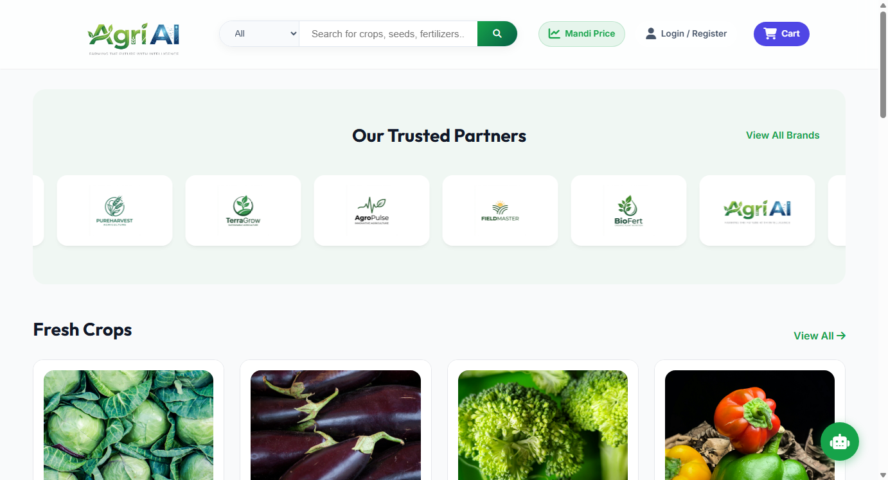
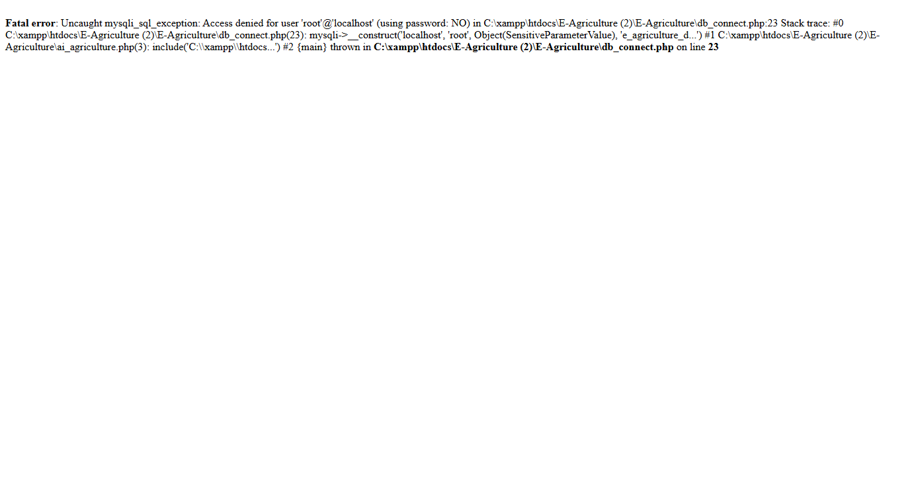
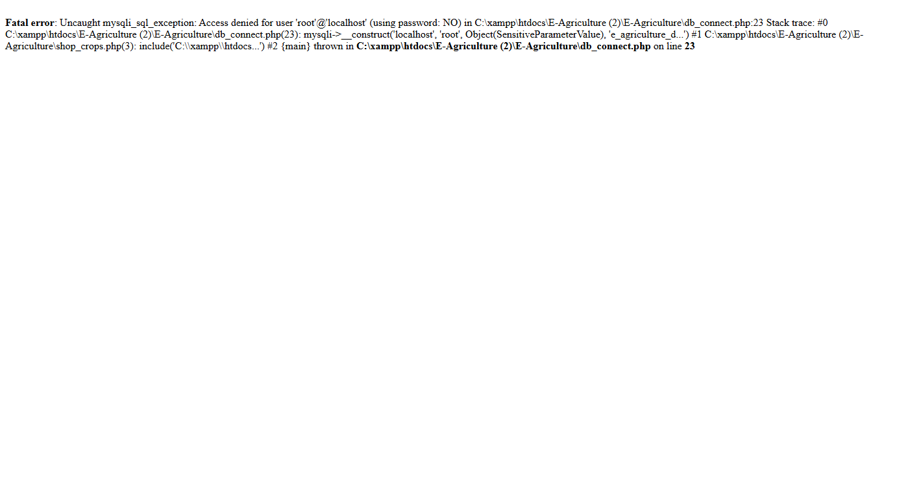
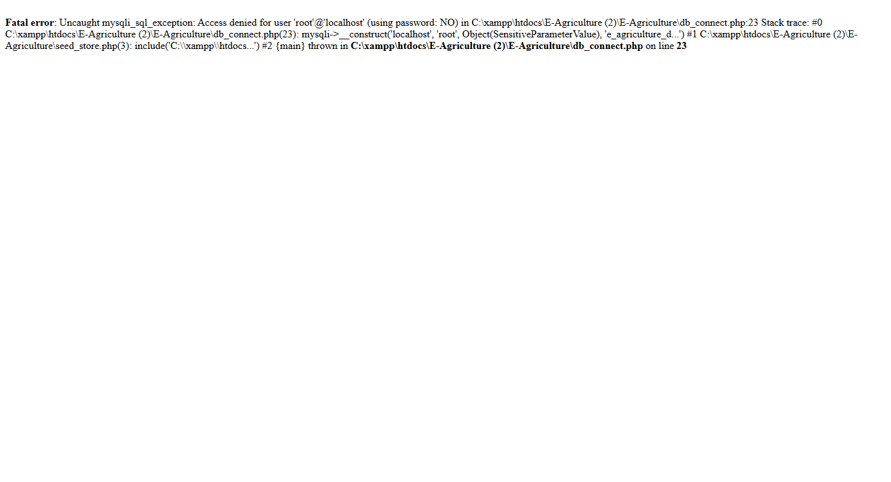
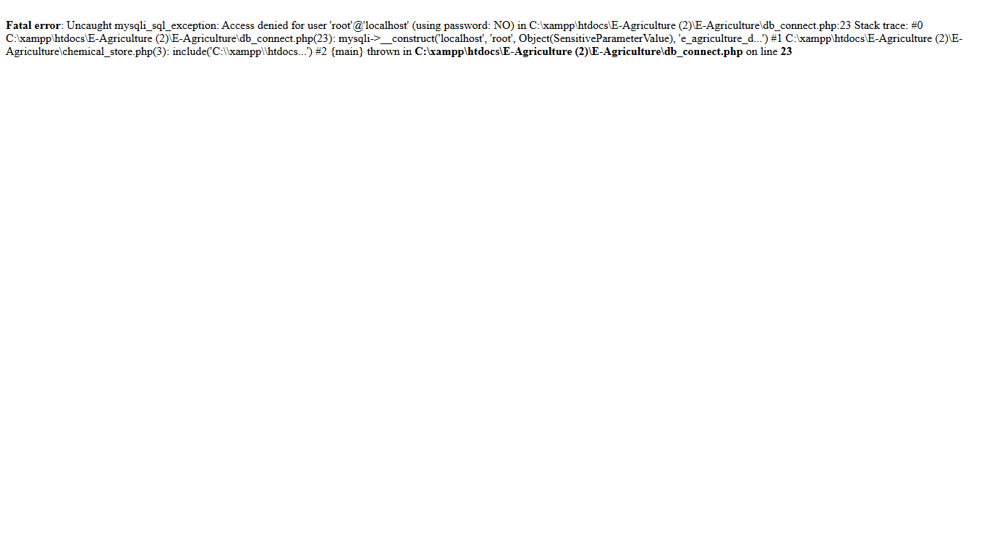
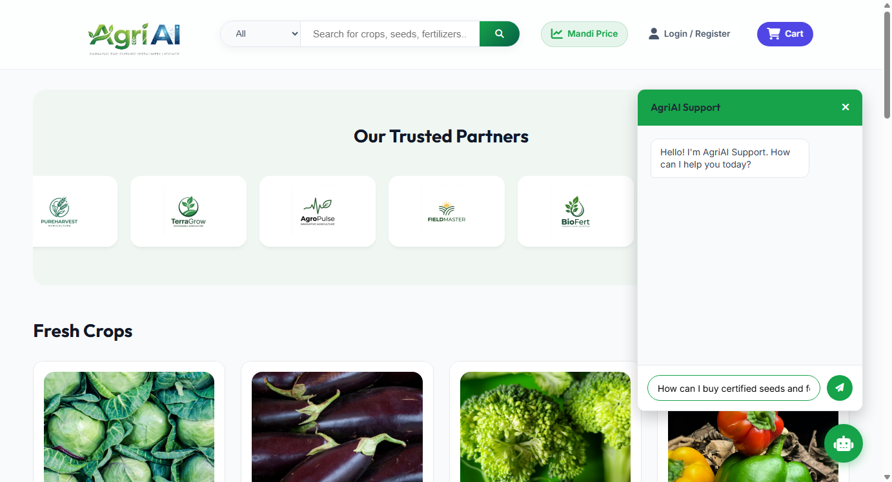
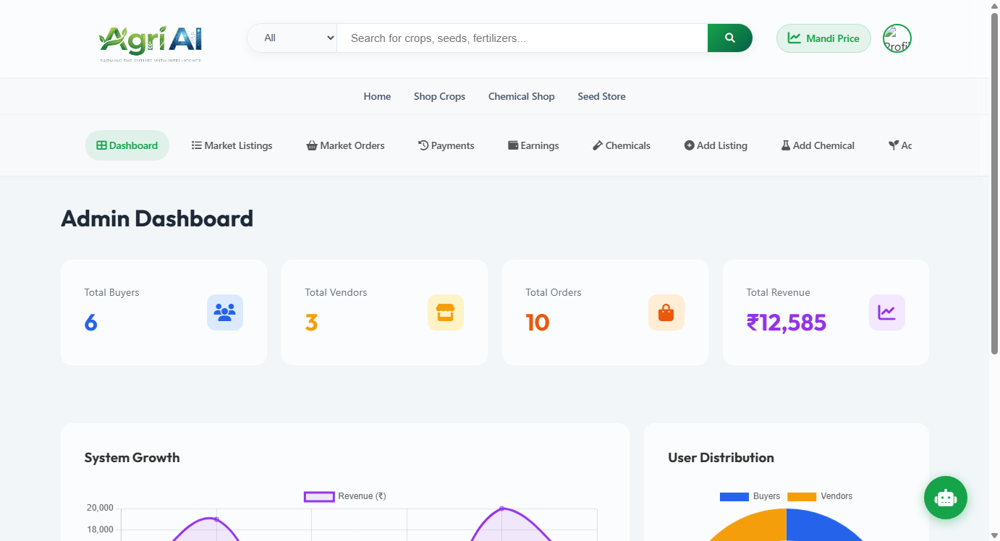
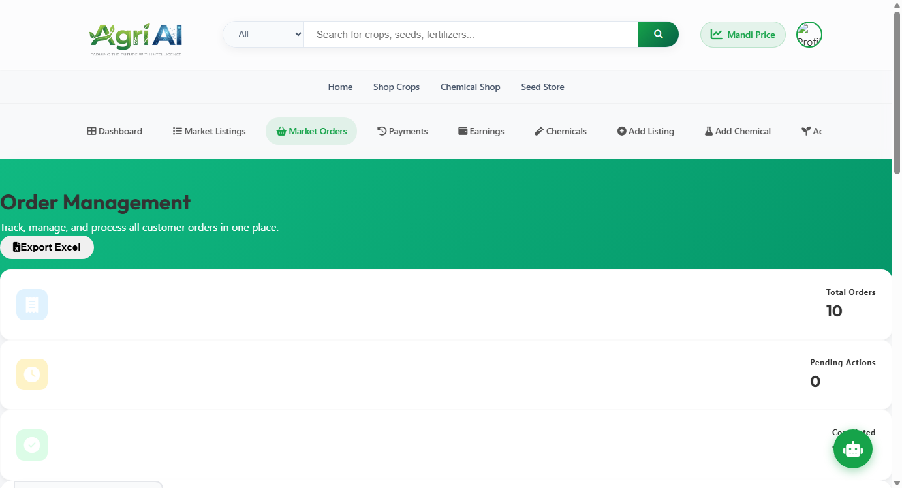
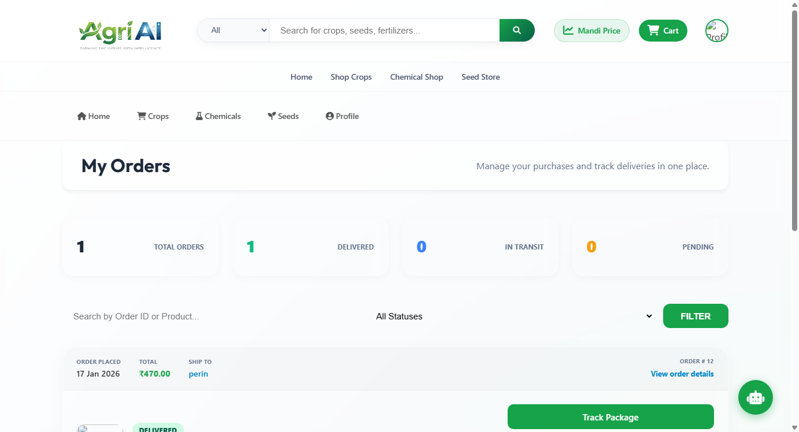
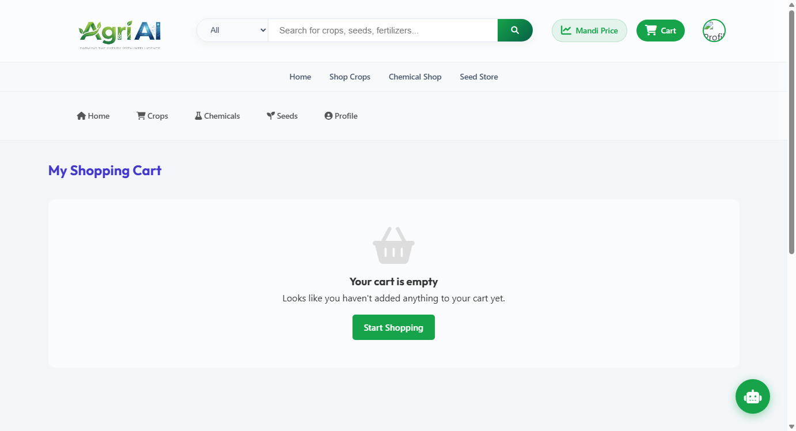

# 🌾 E-Agriculture & Smart Farming Platform

[](https://www.php.net/)
[](https://www.mysql.com/)
[](https://www.python.org/)
[](https://developer.mozilla.org/en-US/docs/Web/JavaScript)
[](LICENSE)

A comprehensive, full-stack **Smart Agriculture & E-Commerce Web Application** designed to empower farmers, buyers, vendors, and agricultural stakeholders. The platform bridges the gap between agricultural producers and consumers while integrating intelligent AI-powered crop disease detection, live weather forecasting, market price trends, seasonal crop guidance, and seamless multi-vendor e-commerce.

---

## 📸 Screenshots & UI Showcase

| 🏠 Home Page | 🤖 AI Crop & Disease Detection |
| :---: | :---: |
|  |  |

| 🌾 Crop Marketplace | 🌱 Seed Store |
| :---: | :---: |
|  |  |

| 🧪 Fertilizer & Chemical Store | 💬 AgriAI Assistant Chatbot |
| :---: | :---: |
|  |  |

| 📊 Admin Dashboard & Analytics | 📦 Admin Orders & Management |
| :---: | :---: |
|  |  |

| 🛍️ Buyer Orders & Tracking | 🛒 Buyer Cart & Checkout |
| :---: | :---: |
|  |  |

| 🔐 Multi-Role Authentication Portal |
| :---: |
|  |

---

## ✨ Key Features

### 🛒 Multi-Vendor Agricultural E-Commerce
- **Crop Marketplace**: Farmers can list their harvested crops directly with prices, stock levels, and quality certifications.
- **Certified Seed Store**: Browse, filter, and buy certified high-yield seeds categorized by season and crop type.
- **Agro-Chemical & Fertilizer Hub**: Verified vendors supply fertilizers, pesticides, and soil boosters with safety instructions and dosage details.
- **Cart & Secure Checkout**: Persistent cart management, coupon discounts, cash on delivery (COD) and online payment options.
- **Order Tracking**: Real-time tracking from dispatch to farm delivery.

### 🧠 Smart AI & Advisory Services
- **AI Crop Disease Diagnosis**: Upload leaf/plant images or input symptoms to diagnose diseases instantly with tailored remedy recommendations.
- **LangChain & AI Assistant**: Integrated customer support bot providing instant answers on cultivation methods, pest management, and order queries.
- **Real-Time Weather Forecasting**: 7-day agricultural weather forecast, precipitation chance, humidity levels, and farming advisories.
- **Mandi & Market Trends**: Live commodity pricing and market trends to help farmers sell at optimal market rates.
- **Seasonal Planting Guide**: Interactive guide tailored for Kharif, Rabi, and Zaid crop cycles.

### 👥 Multi-Role User Portals
- **Farmer Dashboard**: Manage crop listings, track incoming orders, monitor sales revenue, and consult AI advisory.
- **Buyer Portal**: Direct-from-farm produce procurement with order history and ratings/reviews.
- **Vendor Portal**: Agro-chemical and seed inventory management, stock alerts, and fulfillment workflow.
- **Admin Panel**: Comprehensive administrative oversight of users, listings, verifications, orders, and platform statistics.

---

## 🏗️ Architecture & Technology Stack

- **Backend**: PHP 8.x (Native / OOP Architecture)
- **Database**: MySQL / MariaDB (`e_agriculture_db.sql`)
- **AI & Server**: Python 3.x, FastAPI / Uvicorn, LangChain Assistant
- **Frontend**: Responsive HTML5, CSS3, Modern Glassmorphic UI, Vanilla JavaScript, FontAwesome
- **Server Environment**: Apache HTTP Server (XAMPP / WAMP / Linux LAMP)

---

## 🚀 Getting Started & Installation

### Prerequisites
- [XAMPP](https://www.apachefriends.org/) (Apache & MySQL)
- [Python 3.10+](https://www.python.org/) (for AI Assistant / Chatbot services)
- [Git](https://git-scm.com/)

### Step 1: Clone Repository
```bash
git clone https://github.com/shubhammarakana/E-Agriculture.git
```
Place the project folder inside your web server root (e.g., `C:/xampp/htdocs/E-Agriculture`).

### Step 2: Database Setup
1. Open **phpMyAdmin** (`http://localhost/phpmyadmin`).
2. Create a new database named `e_agriculture_db`.
3. Import the SQL file:
   ```sql
   e_agriculture_db.sql
   ```
4. Verify database credentials in [`db_connect.php`](file:///c:/xampp/htdocs/E-Agriculture (2)/E-Agriculture/db_connect.php):
   ```php
   $servername = "localhost";
   $username = "root";
   $password = "";
   $dbname = "e_agriculture_db";
   ```

### Step 3: Run the Web Server
1. Start **Apache** and **MySQL** from XAMPP Control Panel.
2. Open your browser and navigate to:
   ```
   http://localhost/E-Agriculture/index.php
   ```

### Step 4 (Optional): Start AI Chatbot Service
If you want to use the LangChain AI assistant:
```bash
cd langchain-customer-support
python -m venv venv
venv\Scripts\activate       # On Windows
# source venv/bin/activate  # On Linux/macOS
pip install -r requirements.txt
python app/main.py
```

---

## 📁 Project Structure

```
E-Agriculture/
├── admin/                  # Admin control panel and moderation modules
├── buyer/                  # Buyer dashboard and purchase history
├── css/                    # Custom stylesheets and themes
├── farmer/                 # Farmer dashboard and crop management
├── images/                 # Product photos, crop categories, icons
├── includes/               # Reusable headers, footers, navbars, modals
├── js/                     # Client-side scripts and interactive features
├── langchain-customer-support/ # Python LangChain AI backend
├── screenshots/            # Showcase screenshots for documentation
├── uploads/                # Dynamic user uploads (scans, receipts, products)
├── vendor/                 # Vendor portal and chemical catalog
├── ai_agriculture.php      # AI crop disease detection interface
├── browse_crops.php        # Crop catalog and browsing
├── cart.php                # Shopping cart
├── checkout.php            # Order checkout & billing
├── chemical_store.php      # Fertilizers and chemicals catalog
├── database.sql            # Base database schema
├── db_connect.php          # Database connection handler
├── e_agriculture_db.sql    # Complete master database dump
├── index.php               # Platform landing page
├── login.php               # Authentication portal
├── market_trends.php       # Live agricultural market prices
├── seasonal_guide.php      # Seasonal crop guidance
├── seed_store.php          # Certified seeds store
├── weather.php             # Live meteorological weather reports
└── README.md               # Project documentation
```

---

## 🤝 Contributing

Contributions, issues, and feature requests are welcome!
1. Fork the Project
2. Create your Feature Branch (`git checkout -b feature/AmazingFeature`)
3. Commit your Changes (`git commit -m 'Add some AmazingFeature'`)
4. Push to the Branch (`git push origin feature/AmazingFeature`)
5. Open a Pull Request

---

## 📄 License

This project is licensed under the MIT License - see the [LICENSE](LICENSE) file for details.
